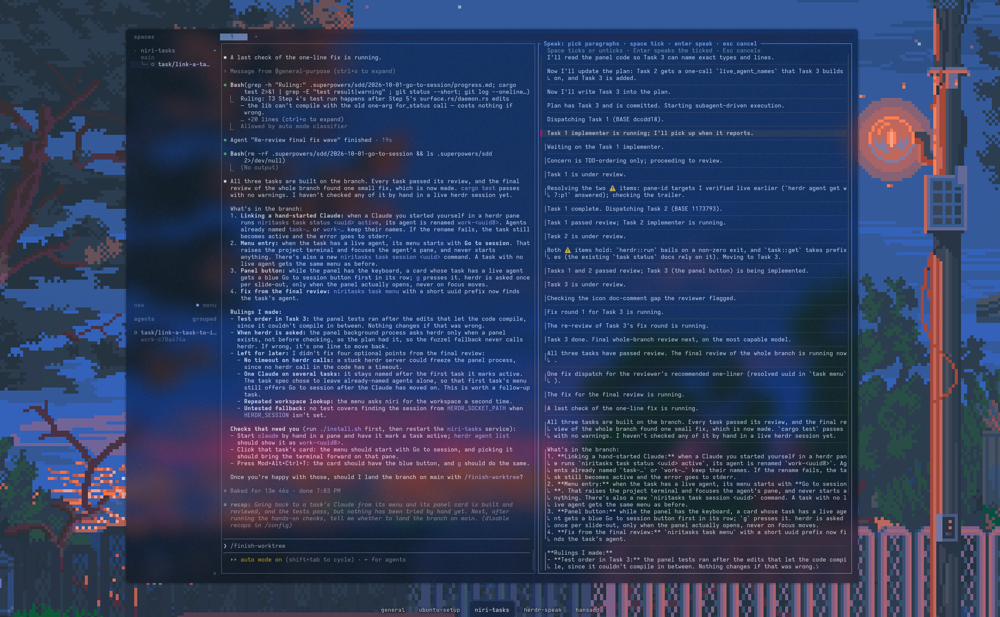
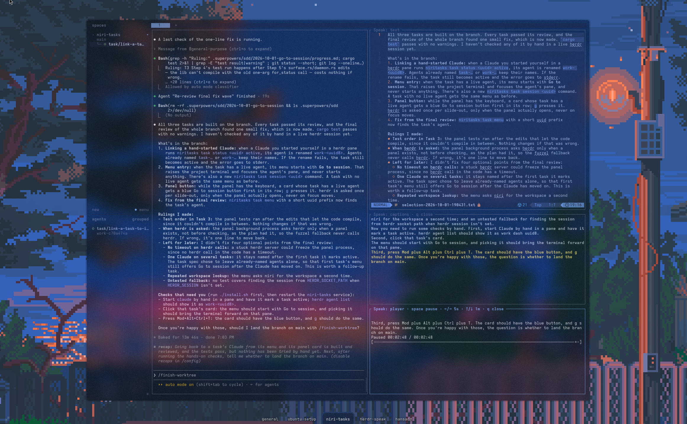

# herdr-speak (work in progress)

herdr-speak reads your coding agent's answers and plans aloud inside herdr, so you can listen instead of reading. It shows live captions and a player beside the pane. It's a work in progress and isn't ready for other people to use yet.



*Pick the paragraphs of the agent's last answer you want to hear. Space ticks or unticks a paragraph, and Enter speaks the ticked ones.*



*While it speaks, the text opens in `nvim` with the live captions under it, the current sentence highlighted, and an `mpv` player under that.*

A [herdr](https://herdr.dev/) plugin that reads aloud, through a local [Kokoro-FastAPI](https://github.com/remsky/Kokoro-FastAPI) text-to-speech server, the parts of a Claude Code or Pi answer you pick, a markdown plan, or text you select. Press `prefix+shift+v` and pick **Last answer** to tick the paragraphs of the focused pane's last answer you want to hear, or **Files** to pick a plan. Select text in copy mode (`prefix+[`) and press `prefix+shift+a` to hear just that part. Each is shown beside the pane with live captions and a player. Press `prefix+shift+b` when you're done to close those panes.

## How it works

`speak.plan` opens an fzf picker over the focused pane that asks for **Files** or **Last answer**. Files lists the markdown files under the pane's working directory and in `~/.claude/plans`, newest first, with a preview. The picker skips hidden and dependency folders (such as `node_modules`) and looks at most six levels deep.

The plugin then prepares the audio: it rewrites the plan with `prompt-plan.md`, which keeps every step and decision in order rather than shortening the plan, and renders the speech without playing it. Extended thinking is turned off for the rewrite, because it can delay the first words by a minute. This takes a few seconds for a short plan and longer for a long one. Meanwhile a pane to the right shows a spinner and the seconds so far, and pressing the key again cancels it. When the audio is ready, the plan opens read-only in `nvim` in a pane to the right. Under it, [sptlrx](https://github.com/raitonoberu/sptlrx) shows the spoken rewrite as live captions with the current sentence in bold, and under that an `mpv` player starts playing. Plans saved before captions existed have no `.lrc`, so they open with just the player until they are prepared again. Focus stays where it was. The player shows the time and a progress bar: space plays and pauses, the left and right arrows seek 5 seconds, up and down seek a minute, and `q` closes it. Quitting `nvim` closes the plan's pane. If the rewrite fails, the plan still opens and its text is read with the markdown removed, but nothing is saved.

The spoken text, its captions and the audio are saved as `spoken/<project>/<name>.md`, `.lrc` and `.opus` in the plugin state directory. That is outside every project and outside `~/.claude`, so an agent never mistakes them for a new plan. The `.lrc` has one line per spoken sentence, stamped with the time Kokoro started saying it (from Kokoro-FastAPI's `/dev/captioned_speech` word timings), so players such as sptlrx and mpv can show the text in step with the audio. The project is the repository name, the same for every worktree of that repository, or the folder name for a file outside git (so files in `~/.claude/plans` land in `spoken/plans/`). The name is the file's path within the repository, with `--` between folders, so `docs/README.md` is saved as `docs--README` and doesn't collide with `README.md`. Picking a plan whose saved audio is newer than the file skips the preparation and plays it straight away. Picking the same plan again reuses its text pane and reopens the captions and player; picking another plan replaces them.

`speak.selection` reads the text selected in the focused pane. Select it in copy mode: press `prefix+[`, move to the start with the arrows or `h/j/k/l`, press `v`, move to the end, then press `prefix+shift+a`. Copy mode matters because outside it herdr clears a selection on any key press, including the prefix, so the action would get nothing. A mouse drag in copy mode works too, but only with `copy_on_select = false` under `[ui]` in herdr's config; otherwise releasing the mouse copies and clears the selection.

It rewrites the selection with `prompt-plan.md` and prepares the audio, which takes a few seconds; a pane to the right shows a spinner meanwhile. Pressing the key again while it prepares cancels it and closes that pane. Then three panes open in a column to the right, without taking focus: the text you selected, read-only in `nvim` with markdown highlighting, live captions of the spoken rewrite from [sptlrx](https://github.com/raitonoberu/sptlrx) that highlight the sentence being spoken, and the `mpv` player, already playing. Pause and seek in the player and the captions follow. Quit `nvim`, and press `q` in the captions and the player, to close their panes. A selection replaces an open plan's panes, and picking a plan replaces the selection's. If nothing is selected, it shows a "Speak: nothing selected" notification, but herdr doesn't pop up notifications for the tab you're in, so you may not see it.

Each selection is saved as `spoken/<project>/selection-<date>-<time>` with four files: `.txt` (the text you selected), `.md` (the spoken rewrite), `.lrc` (its captions) and `.opus`. The project is named the same way as for plans, from the focused pane's folder. A run that is cancelled or fails saves nothing. sptlrx runs with its own settings from the plugin state directory, so your own sptlrx config is left alone.

Last answer reads the focused pane's last answer from the session herdr records for it, and lets you leave out what you don't want to hear, such as the agent's interim notes between tool calls. A pane opens to the right of the agent's pane, where the audio panes go, replacing any that are open, and takes focus. It shows the answer split into paragraphs at blank lines, with each fenced code block kept whole, and every paragraph ticked. Move with the arrow keys, press Space to untick or tick a paragraph, and press Enter to hear the ticked ones in their original order. Esc closes the pane and does nothing. Enter does nothing while nothing is ticked. While the agent is working, the paragraphs come from its last finished answer, not the one in progress. After Enter, the spinner takes the pane's place, and the picked text is spoken exactly like a selection: it is rewritten with `prompt-plan.md`, saved as `spoken/<project>/selection-<date>-<time>`, and shown with live captions and a player. Pressing the key again while it prepares cancels it.

| Action | Suggested key | What it does |
| --- | --- | --- |
| `speak.plan` | `prefix+shift+v` | Pick a markdown plan, or paragraphs of the last answer, prepare the audio, then show it beside the pane with live captions and a player. Invoke again to cancel preparing. |
| `speak.selection` | `prefix+shift+a` | Speak the selected text, rewritten for listening, and show it beside the pane with live captions and a player. Invoke again to cancel preparing. |
| `speak.close` | `prefix+shift+b` | Stop any speech or preparing, and close the spinner, text, captions and player panes the plugin opened, leaving the layout as it was. |
| `speak.stop` | | Stop playback. |

## Requirements

- herdr 0.9.1 or newer, with the Claude integration installed (`herdr integration install claude`).
- A Kokoro-FastAPI server, by default at `http://127.0.0.1:8880/v1`, with the `/dev/captioned_speech` endpoint for the word timings behind captions (without it, captions fall back to one line per chunk).
- `python3`, `ffplay` and `ffmpeg` (with libopus) from FFmpeg, `fzf` 0.60 or newer for the plan picker, the chooser and the paragraph picker, `nvim` to show the plan or selected text, `mpv` for the replay player, `sptlrx` and `mpv-mpris` for live captions (`sudo apt install sptlrx mpv-mpris`), and the `claude` CLI signed in.

## Start Kokoro on an NVIDIA GPU

Kokoro runs in Docker. The host needs an NVIDIA driver, Docker Engine, and the NVIDIA Container Toolkit. Follow the official [Docker installation guide](https://docs.docker.com/engine/install/ubuntu/) and [NVIDIA Container Toolkit guide](https://docs.nvidia.com/datacenter/cloud-native/container-toolkit/install-guide.html). Confirm the host driver works with `nvidia-smi` and that Docker accepts `--gpus all`. You do not need a host CUDA Toolkit or Python for Kokoro: the GPU image contains its runtime and dependencies.

The plugin starts Kokoro for you. When the server at a local `baseUrl` doesn't answer `/health`, it runs `docker start kokoro-tts`. If that container doesn't exist yet, it runs the `docker run` command below, choosing the image for your GPU with `nvidia-smi`. Then it waits up to two minutes for Kokoro to report healthy. A notification tells you it is starting. The first `docker run` also downloads the image, which takes longer. You can still start Kokoro yourself with the command below.

For an RTX 50-series or other Blackwell GPU, use Kokoro's CUDA 12.8 image:

```bash
docker run -d --name kokoro-tts --restart unless-stopped \
  --gpus all -p 127.0.0.1:8880:8880 \
  ghcr.io/remsky/kokoro-fastapi-gpu:latest-cu128
```

For an RTX 30 or 40 series GPU, use `ghcr.io/remsky/kokoro-fastapi-gpu:latest` instead. Check the [Kokoro image instructions](https://github.com/remsky/Kokoro-FastAPI) for your GPU. The `127.0.0.1` port binding makes the speech API available only on this computer.

Confirm Kokoro is ready:

```bash
curl --fail --silent --show-error http://127.0.0.1:8880/health
```

The expected response includes `"status":"healthy"`.

## Install

```bash
herdr plugin link ~/Projects/herdr-speak
```

Then add this to `~/.config/herdr/config.toml` and run `herdr server reload-config`:

```toml
[[keys.command]]
key = "prefix+shift+v"
type = "plugin_action"
command = "speak.plan"
description = "speak: pick a plan file or last-answer paragraphs and read them aloud (again to cancel)"

[[keys.command]]
key = "prefix+shift+a"
type = "plugin_action"
command = "speak.selection"
description = "speak: read the selected text aloud (again to cancel)"

[[keys.command]]
key = "prefix+shift+b"
type = "plugin_action"
command = "speak.close"
description = "speak: stop and close the text, captions and player panes"
```

Any of these keys cancels a plan, selection or picked answer being prepared, whichever key started it. Once a plan or selection is playing, `mpv` plays it, so press `q` in the player to stop it. When you're done, `prefix+shift+b` stops everything and closes every pane the plugin opened in one go; panes you closed yourself are skipped, and your own panes are never touched.

The plan, selection and close keys avoid herdr's own bindings: `prefix+shift+p` renames a pane, `prefix+shift+r` reloads the config and `prefix+shift+x` closes a tab.

For Pi panes, run `herdr integration install pi` so herdr records Pi's session. Without it, the plugin falls back to the newest Pi session in the pane's working directory.

## Configure

The voice, speed, and server come from `~/.pi/speak.json` when it exists, so Pi's [privateer-speak](https://pi.dev/packages/privateer-speak) and this plugin sound the same. To override them, put a `config.json` in the directory printed by `herdr plugin config-dir speak`:

```json
{
  "baseUrl": "http://127.0.0.1:8880/v1",
  "voice": "af_bella",
  "speed": 1.0,
  "rewrite": true,
  "rewriteModel": "haiku",
  "rewriteTimeout": 60,
  "planRewriteTimeout": 300,
  "spokenDir": "~/.local/state/herdr/plugins/speak/spoken",
  "autoStart": true,
  "container": "kokoro-tts",
  "startTimeout": 120
}
```

`planRewriteTimeout` is how many seconds a plan's rewrite may take, which is longer than for selections because plans are long. `spokenDir` is where spoken plans and selections are saved. Keep it outside your projects and `~/.claude`. A selection's or picked answer's rewrite uses `rewriteTimeout` and always happens, even with `"rewrite": false`, which only makes plans read as written.

Set `autoStart` to `false` to stop the plugin from starting Docker. When the plugin creates the container, it picks the image from the GPU's compute capability. It uses `ghcr.io/remsky/kokoro-fastapi-gpu:latest-cu128` for an RTX 50-series or other Blackwell GPU and `ghcr.io/remsky/kokoro-fastapi-gpu:latest` for an RTX 30 or 40 series. To override the choice, set `"image"` in `config.json`.

`player` can also be set to another command that plays raw 24 kHz mono 16-bit PCM from standard input, such as `["pw-play", "--rate", "24000", "--channels", "1", "--format", "s16", "-"]`.

Errors appear as herdr notifications. The worker log is at `~/.local/state/herdr/plugins/speak/speak.log`.

## Privacy

The plan files, selections and last-answer paragraphs you pick are rewritten for listening by `claude -p`, so their text goes to Anthropic through your own Claude Code login. With `"rewrite": false`, plans are read as written and are not sent; selections and last-answer paragraphs are always rewritten. The audio is made by the Kokoro server at `baseUrl`, which by default runs locally on `127.0.0.1`. If you point `baseUrl` at another host, the spoken text goes there too. The spoken text, captions and audio are saved in the plugin state directory (`~/.local/state/herdr/plugins/speak/`), or under `spokenDir` if you set it. The last answer and the paragraphs you picked from it are kept in the state directory as `answer.md` and `chosen.md`.

## License

MIT. See [LICENSE](LICENSE).

The markdown stripping in `speak.py` is adapted from [privateer-speak](https://pi.dev/packages/privateer-speak) by Patrick (zahnno), also MIT licensed.
